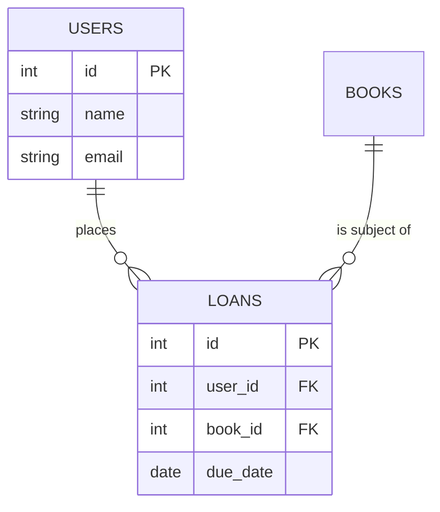

# ERD Generator

## Purpose

Convert an unstructured domain description into a syntactically valid Mermaid `erDiagram`, write it to disk, and compile it into a rendered SVG asset — self-correcting automatically if compilation fails.

## Execution Workflow

1. **Parse the domain description.** Identify entities, attributes, primary keys (`PK`), foreign keys (`FK`), and relationships between entities. Use any explicit business rules the user states to resolve ambiguity (e.g. "a loan belongs to exactly one borrower, a borrower may have many loans"). Where the prompt leaves something ambiguous, make the most conventional relational-modeling choice and state that assumption in your final output rather than guessing silently.

2. **Draft Mermaid syntax.** Write the complete `erDiagram` block directly to `docs/architecture/schema.mmd`, creating the `docs/architecture/` directory first if it doesn't exist. Example shape:

3. **Validate and render.** Execute: 

node .agent/skills/erd-generator/scripts/render_erd.js docs/architecture/schema.mmd docs/architecture/erd.svg

4. **Self-correction loop.** If the script exits with a non-zero status and prints a line beginning with `SYNTAX_ERROR:`, read the trace that follows it, identify the specific problem (common ones: unbalanced relationship tokens like `||--o{`, an attribute type that isn't a bare identifier, a duplicate entity name, a missing closing brace on an attribute block), correct `docs/architecture/schema.mmd` accordingly, and re-run step 3. Retry up to **3 times total**. If all 3 attempts still fail, stop and report the final error message to the user rather than retrying indefinitely or silently abandoning the task.

5. **Final output.** Once the script prints `SUCCESS`:
   - Present the final Mermaid code block to the user, exactly as written to `schema.mmd`.
   - Reference the rendered asset path: `docs/architecture/erd.svg`.
   - Briefly note any ambiguity-resolving assumptions made in step 1.

## Mapping Conventions

- Entity names: `UPPER_SNAKE_CASE` in the diagram (the downstream `kysely-migration-generator` skill converts these to `snake_case` table names).
- Mark every primary key attribute with `PK` and every foreign key attribute with `FK`, on the same line as the attribute.
- Relationship tokens:
  - `||--o{` — one-to-many (exactly one on the left, zero-or-more on the right)
  - `||--o|` — one-to-one (exactly one on each side, optional on the right)
  - `}o--o{` — many-to-many
- Every entity referenced in a relationship line must also have a corresponding attribute block (or be clearly a stub entity if the user has stated it already exists elsewhere, per their prompt).